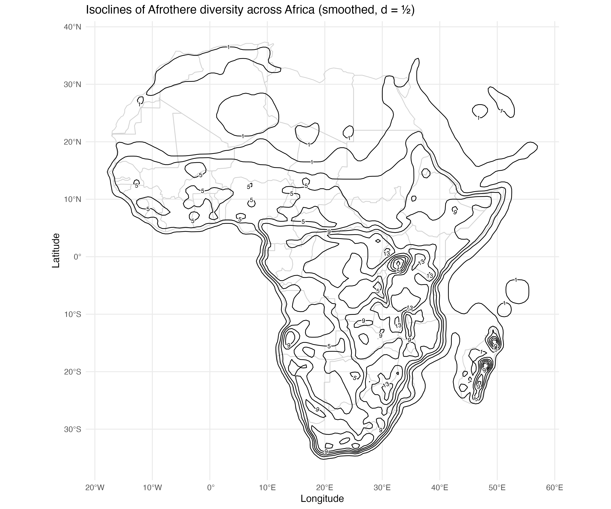
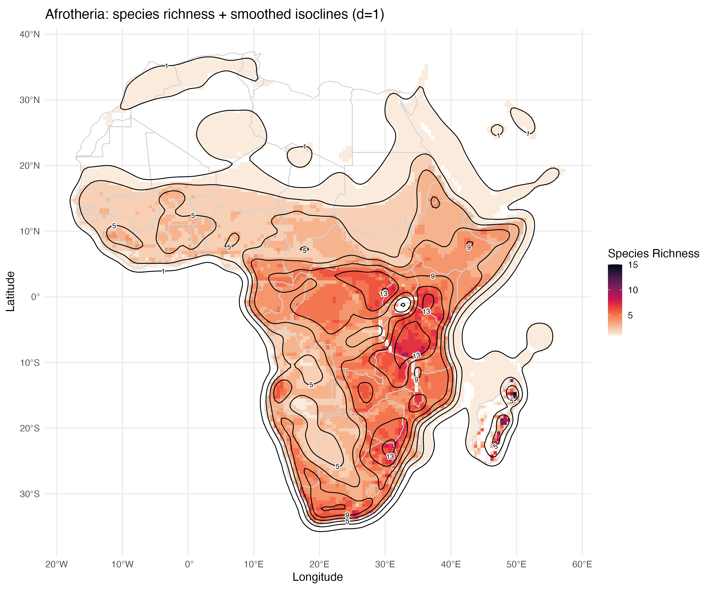

# AfrotheriAtlas 🐘🗺️

**AfrotheriAtlas** is an R-based suite of tools and an interactive Shiny application designed to explore the community composition and species richness of the superorder **Afrotheria** across Africa and the Arabian Peninsula.  

The interactive explorer is also available online at: [Afrotheria Shiny App](https://afrotheria.shinyapps.io/afrotheria_explr/), allowing users to query coordinates, visualize species richness, and download local community compositions without installing R locally.

## 🌟 Features

- **Interactive Explorer:** A Shiny web application to query specific coordinates for local species lists.
- **Richness Isoclines:** Scripts to generate smoothed and raw contour maps (isoclines) of biodiversity.
- **Automated Data Pipeline:** Functions to download range maps directly from the Mammal Diversity Database (MDD) and process them into spatial rasters.
- **Community Analysis:** Download local community compositions as CSV files directly from the map interface.

## 🛠️ Installation & Setup

Before running the app, ensure you have the following R libraries installed:

```R
install.packages(c(
  "shiny", "leaflet", "sf", "terra", "dplyr", "DT", 
  "viridis", "shinycssloaders", "ggplot2", "rnaturalearth", "metR"
))
```

Requires the `mdd` package for range map downloads.

### 1. Data Preparation

The project relies on a cached data structure for performance. Follow these steps:

1. **Initialize Data:**

```R
source("load_afrotheres.R")
```

This script downloads the range maps for all Afrotherian species and generates the initial richness raster. It automatically incorporates manual fixes for species like the African Manatee (_Trichechus senegalensis_) via `missing_maps.R`.

2. **Build Cache:**

```R
source("build_afrothere_cache.R")
```

Transforms the raw spatial data into a compressed `.rds` format and prepares the `.tif` rasters required for the Shiny app.

### 2. Launching the App

Once `afrotheria_cache.rds` and `afrotheria_richness_africa.tif` are generated, launch the interactive explorer:

```R
shiny::runApp("app.R")
```

## 📂 File Structure

| File | Description |
|------|-------------|
| `app.R` | The main Shiny application code (UI & Server). |
| `build_afrothere_cache.R` | Pre-processes spatial data into optimized formats for the app. |
| `isocline.R` | Generates high-quality ggplot2 contour maps and smoothed richness visualizations. |
| `load_afrotheres.R` | The primary data acquisition script using the `mdd` package. |
| `missing_maps.R` | Handles edge cases and local KML imports for species with missing MDD geometries. |

## 📊 Visualizations

The `isocline.R` script produces three distinct types of maps:

- **Raw Contours:** Precise integer-based richness breaks.
- **Smoothed Contours:** Gaussian-smoothed trends for better regional visualization.
- **Overlay:** Smoothed isoclines layered over the high-resolution richness raster.

### Figures

#### Smoothed Contours
  
*Figure 1: Gaussian-smoothed richness contours showing regional trends with low smoothness (d = ½).*


#### Afrotheria Richness Overlay
  
*Figure 2: Smoothed isoclines (d = 1) of Afrotheria species richness overlaid on the high-resolution richness raster.*


## 📜 License & Data Credits

- **Data Source:** [Mammal Diversity Database (MDD)](https://www.mammaldiversity.org/)
- **Spatial Boundaries:** [Natural Earth](https://www.naturalearthdata.com/)

### Required R Packages

The following R packages are needed to run **AfrotheriAtlas**:

- shiny
- leaflet
- sf
- terra
- dplyr
- DT
- viridis
- shinycssloaders
- ggplot2
- rnaturalearth
- metR
- mdd (for downloading range maps)

### Install Packages in R

\\\R
install.packages(c(
  "shiny", "leaflet", "sf", "terra", "dplyr", "DT", "mdd",
  "viridis", "shinycssloaders", "ggplot2", "rnaturalearth", "metR"
))

\\\
